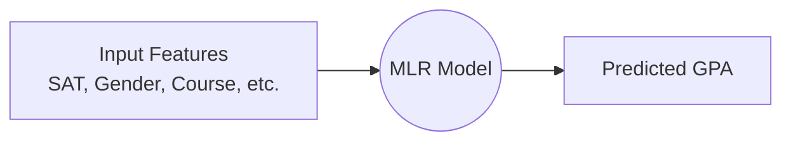
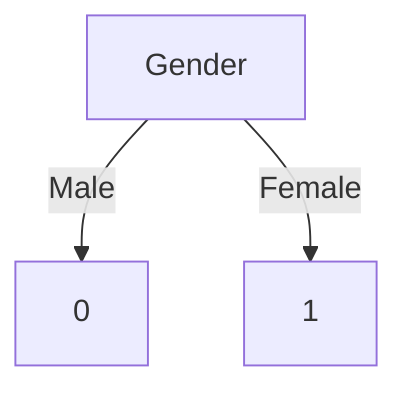
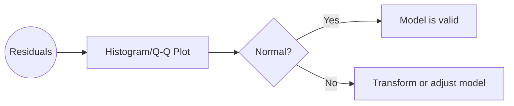
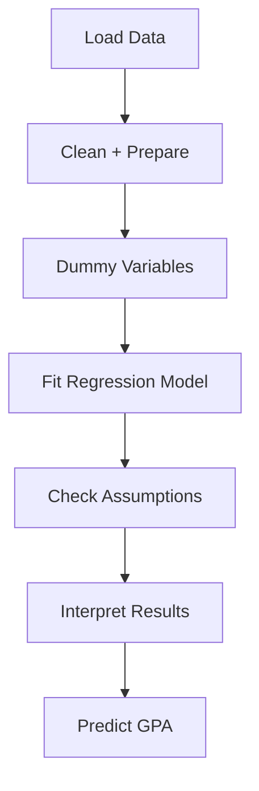

# 📘 Multiple Linear Regression Project  
### **Complete Beginner‑Friendly Guide with Visuals, Diagrams & Explanations**

This repository contains a fully explained implementation of **Multiple Linear Regression**, including dummy variables, assumption testing, and interpretation of results — based on the course material provided in the SRT files.

---

## 📂 Repository Structure

```
├── Dummy_Variables/       # Handling categorical data using dummy variables
├── Assumption_Tests/      # Testing MLR assumptions (normality, homoscedasticity, etc.)
├── notebooks/             # Jupyter notebooks for complete end‑to‑end workflow
├── data/                  # Datasets used in analysis (SAT, GPA, categorical data)
└── README.md              # You are here
```

---

# 🧠 What You Will Learn

### ✔ What Multiple Linear Regression Is  
### ✔ How to Encode Categorical Variables (Dummy Variables)  
### ✔ How to Interpret Coefficients  
### ✔ All 5 MLR Assumptions Explained Beginner‑Friendly  
### ✔ How the Provided Code Works Step‑By‑Step  
### ✔ How to Read Regression Output (R², p‑values, F‑statistic)  
### ✔ Diagrams + Visual Learning Included  

---

# 🎯 Goal of the Project

The project predicts **GPA** based on:

- SAT score (numerical)
- Dummy variables (categorical predictors like gender, college type, course, etc.)

This is a realistic use‑case of multiple regression in education analytics.

---

# 🧩 What Is Multiple Linear Regression?

Multiple Linear Regression (MLR) is a model used to **predict a numerical value** using **two or more independent variables**.

Example:

```
GPA = β₀ + β₁(SAT) + β₂(Gender_dummy) + β₃(CollegeType_dummy) + … + error
```

---

# 📊 Visual: How MLR Works



---

# 📚 Dummy Variables (Explained Like a Beginner)

Many real‑world variables are **categorical**:

- Gender → Male / Female  
- Course → Science / Arts / Commerce  
- College Type → Public / Private  

ML models **cannot understand text** — so we convert categories into **0/1 values**.

### Example:

| Gender | Dummy (Female) |
|--------|----------------|
| Male   | 0              |
| Female | 1              |

This lets the model compare groups.

---

# 📘 Visual: Dummy Variable Encoding



---

# 🔍 All **5 Assumptions** of Multiple Linear Regression  
(Explained extremely simply)

## 1️⃣ **Linearity**
Relationship between predictors and GPA must be roughly straight‑line.

```
SAT ↑ → GPA ↑ (approximately linear)
```

## 2️⃣ **No Perfect Multicollinearity**
Predictors must not duplicate each other.

Bad example:

- SAT
- SAT percentile

Both measure the same thing → bad for the model.

## 3️⃣ **Zero Mean of Residuals**
Errors should average to zero.

## 4️⃣ **Homoscedasticity**
Error spread should be constant.

Bad:

```
<   <  <   <     (small errors)
       >         (large errors)
```

## 5️⃣ **Normality of Residuals**
Residuals should form a bell curve.

---

# 📊 Visual: Residual Normality Check



---

# 🧪 Assumption Tests Included in This Project

- Q‑Q Plot  
- Residual vs Fitted Plot  
- Normality tests  
- VIF (Variance Inflation Factor)  
- Homoscedasticity checks  
- p‑values to check significance  

---

# 🧠 Understanding Regression Output (Beginner Level)

### **✔ R²**  
How much of GPA is explained by SAT + dummy variables.

### **✔ Coefficients**  
Show how much GPA changes with 1 unit increase in SAT or switching category.

### **✔ p-values**  
Tell whether predictors are statistically significant.

### **✔ F‑statistic**  
Tells whether the model is meaningful overall.

---

# 🧩 Example Interpretation (Simple)

```
SAT coefficient = 0.002
```

Means:

> For every +1 SAT point, GPA increases by 0.002 (holding other variables constant).

---

# 💻 Source Code Explanation (From SRT + Notebook)

The code:

- Loads SAT + categorical data  
- Converts categories using dummy variables  
- Builds an OLS model  
- Evaluates assumptions  
- Prints interpretation‑ready results  

Every step in the notebook is commented clearly to match the SRT course lessons.

---

# 🖼 Diagram: Full Workflow



---

# 🏁 Final Notes

This repository is designed so **even a complete beginner** can:

- Understand how multiple regression works  
- Learn dummy variables  
- Check assumptions  
- Interpret results  
- Apply regression to real datasets  

---

# 🙌 Author  
**M Israr Ali**  
Machine Learning & Data Engineering Learner  

---

# ⭐ If you find this helpful  
Please **star the repository** on GitHub!

